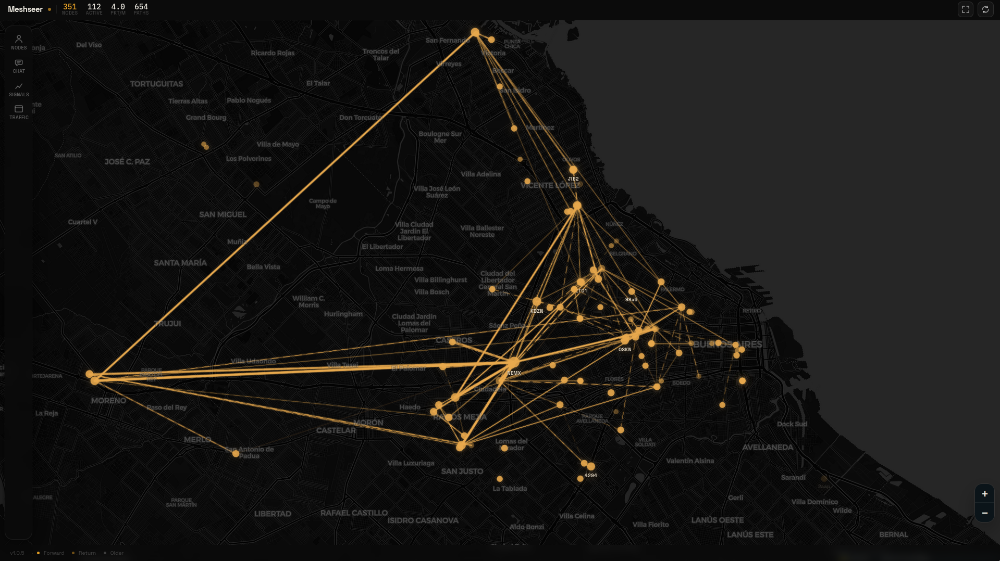

# Meshseer

[](https://github.com/JuanMHuerta/meshseer/actions/workflows/tests.yml)

Meshseer is a web view of a Meshtastic receiver's LongFast traffic. It shows what one receiver has heard on the primary channel: node map, broadcast chat, recent packets, and passive route data.

Try it:

- Live site: <https://meshseer.nemexix.com/>
- Container image: `ghcr.io/juanmhuerta/meshseer`

[](https://meshseer.nemexix.com/)

## Current Scope

- receiver perspective only; this is not an authoritative whole-mesh view
- primary channel only
- Meshtastic TCP interface only today
- public UI is read-only
- auto-traceroute is optional, local-only, and disabled by default
- frontend assets are vendored locally; the default basemap tiles still come from CARTO/OpenStreetMap

## Quick Start With Docker

Requirements:

- Docker with Compose support
- a Meshtastic node reachable over TCP, usually on port `4403`

1. Copy the environment template:

```bash
cp .env.example .env
```

2. Edit `.env` and set at least:

```dotenv
MESHSEER_MESHTASTIC_HOST=192.168.1.50
MESHSEER_MESHTASTIC_PORT=4403
MESHSEER_ENV=production
```

3. Start Meshseer:

```bash
docker compose up -d --build
```

4. Open `http://127.0.0.1:8000/`

5. Optional sanity check:

```bash
curl http://127.0.0.1:8000/api/status
```

Notes:

- The Compose setup persists SQLite data in the named volume `meshseer-data`.
- The container listens on `0.0.0.0:8000` internally and is published on `127.0.0.1:8000` by default.
- If you want local-only admin routes, also set `MESHSEER_ADMIN_BEARER_TOKEN` in `.env`.
- Docker support currently assumes Meshtastic TCP. USB serial passthrough and BLE are not implemented.

## Run From Source

Requirements:

- `uv`
- Python `3.13` if you are managing the interpreter yourself

Setup and run:

```bash
uv sync
cp .env.example .env
./start.sh
```

`start.sh` loads `.env` if present, creates the database directory if needed, and runs a small preflight check before starting Uvicorn.

For trusted LAN testing on a development machine, set:

```dotenv
MESHSEER_BIND_HOST=0.0.0.0
MESHSEER_BIND_PORT=8000
MESHSEER_ENV=development
```

For production, leave `MESHSEER_BIND_HOST` unset or set it explicitly to `127.0.0.1`.

## Configuration

Use [.env.example](.env.example) as the baseline. The most important settings are:

- `MESHSEER_MESHTASTIC_HOST`: Meshtastic TCP hostname or IP. Defaults to `localhost`.
- `MESHSEER_MESHTASTIC_PORT`: Meshtastic TCP port. Defaults to `4403`.
- `MESHSEER_DB_PATH`: SQLite database path. Defaults to `./data/meshseer.db` when running locally.
- `MESHSEER_LOCAL_NODE_NUM`: optional override for the receiver node number shown in the UI and API.
- `MESHSEER_ENV`: `development` or `production`. Production disables `/docs`, `/redoc`, and `/openapi.json`.
- `MESHSEER_BIND_HOST`, `MESHSEER_BIND_PORT`: HTTP bind settings.
- `MESHSEER_ADMIN_BEARER_TOKEN`: enables the local-only admin API.

Additional supported settings:

- websocket tuning: `MESHSEER_WS_MAX_CONNECTIONS`, `MESHSEER_WS_QUEUE_SIZE`, `MESHSEER_WS_SEND_TIMEOUT_SECONDS`, `MESHSEER_WS_PING_INTERVAL_SECONDS`, `MESHSEER_WS_PING_TIMEOUT_SECONDS`
- retention and pruning: `MESHSEER_RETENTION_PACKETS_DAYS`, `MESHSEER_RETENTION_NODE_METRIC_HISTORY_DAYS`, `MESHSEER_RETENTION_TRACEROUTE_ATTEMPTS_DAYS`, `MESHSEER_RETENTION_PRUNE_INTERVAL_SECONDS`
- autotrace: `MESHSEER_AUTOTRACE_ENABLED`, `MESHSEER_AUTOTRACE_INTERVAL_SECONDS`, `MESHSEER_AUTOTRACE_TARGET_WINDOW_HOURS`, `MESHSEER_AUTOTRACE_COOLDOWN_HOURS`, `MESHSEER_AUTOTRACE_ACK_ONLY_COOLDOWN_HOURS`, `MESHSEER_AUTOTRACE_RESPONSE_TIMEOUT_SECONDS`

## What Meshseer Stores

Meshseer persists:

- primary-channel packets received by the connected receiver
- the latest known state for each heard node
- passive route information derived from observed `TRACEROUTE_APP` and route-reply packets
- traceroute attempt records if auto-traceroute is enabled

The route overlay only appears when Meshseer has an ordered hop list to draw. ACK-only or error responses do not create a visible path.

## Demo And Headless Preview

If you want to inspect the UI without live radio hardware:

1. Install the dev environment:

```bash
uv sync --extra dev
```

2. Install Chromium for Playwright once:

```bash
uv run --extra dev playwright install chromium
```

3. Start the seeded demo app:

```bash
uv run meshseer-demo --port 8765
```

4. Capture screenshots:

```bash
uv run --extra dev python scripts/headless_capture.py --url http://127.0.0.1:8765/
```

This writes screenshots to `artifacts/headless/`.

## Auto-Traceroute

Auto-traceroute is the only intentionally active backend feature. It remains disabled by default and is meant for protected, local-only use.

When enabled, Meshseer:

- sends at most one traceroute per configured interval
- targets recent RF nodes only
- skips the local node, MQTT nodes, and nodes without `hops_away`
- applies cooldowns after attempts, including failed ones
- records each attempt in SQLite with timestamps, hop limit, status, and packet IDs when available

Default values:

- `MESHSEER_AUTOTRACE_ENABLED=false`
- `MESHSEER_AUTOTRACE_INTERVAL_SECONDS=300`
- `MESHSEER_AUTOTRACE_TARGET_WINDOW_HOURS=24`
- `MESHSEER_AUTOTRACE_COOLDOWN_HOURS=24`
- `MESHSEER_AUTOTRACE_ACK_ONLY_COOLDOWN_HOURS=6`
- `MESHSEER_AUTOTRACE_RESPONSE_TIMEOUT_SECONDS=20`

The admin API is mounted only when `MESHSEER_ADMIN_BEARER_TOKEN` is configured.

Admin endpoints:

- `GET /api/admin/health`
- `GET /api/admin/mesh/autotrace`
- `POST /api/admin/mesh/autotrace/enable`
- `POST /api/admin/mesh/autotrace/disable`
- `GET /api/admin/mesh/links`
- `GET /api/admin/nodes`
- `GET /api/admin/packets/{packet_id}`

Example:

```bash
export MESHSEER_ADMIN_BEARER_TOKEN='replace-me'

curl -H "Authorization: Bearer ${MESHSEER_ADMIN_BEARER_TOKEN}"   http://127.0.0.1:8000/api/admin/mesh/autotrace
```

Attempt statuses:

- `success`: a route-bearing reply was received
- `ack_only`: a routing ACK was received without route data
- `no_route`: the radio replied with a routing error such as `NO_ROUTE`
- `timeout`: no response arrived before the timeout
- `error`: the send path or response decoding failed unexpectedly

`ack_only` still counts as an attempt, but it does not produce a route line on the map.

## Production Notes

- Keep the app bound to loopback in production.
- `/ws/events` accepts same-origin browser connections only.
- Admin routes are intended to stay local-only behind `MESHSEER_ADMIN_BEARER_TOKEN`.
- The public dashboard uses `/api/status`; `/api/health` is primarily for local health checks.

Deployment notes for the public dashboard plus local-only admin topology live in [deployment.md](deployment.md).

For a concrete Proxmox LXC plus Cloudflare Tunnel rollout, see [deploy/proxmox/README.md](deploy/proxmox/README.md).

## License

Meshseer is licensed under `GPL-3.0-only`. See [LICENSE](LICENSE).

Third-party asset notices and included upstream license texts live in [THIRD_PARTY_NOTICES.md](THIRD_PARTY_NOTICES.md).
